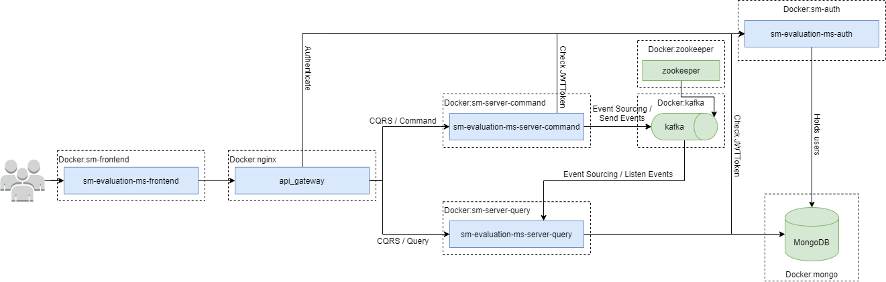

# sm-evaluation-microservices

Architecture:

To run:

    docker-compose up

To stop

    docker-compose down

## sm-evaluation-ms-frontend
To run:

    ng serve

To prepare docker image:

    docker build --no-cache -t sm-evaluation-microservices/sm-evaluation-ms-frontend .

To run a docker image

    docker run -p 4200:80 -t sm-evaluation-microservices/sm-evaluation-ms-frontend

## sm-evaluation-ms-server-query
To prepare a docker image:
    
    docker build --no-cache -t sm-evaluation-microservices/sm-evaluation-ms-server-query .

To run:

    docker run -p 8080:8080 -t sm-evaluation-microservices/sm-evaluation-ms-server-query

## sm-evaluation-ms-server-command
To prepare a docker image:

    docker build --no-cache -t sm-evaluation-microservices/sm-evaluation-ms-server-command .

To run:

    docker run -p 8080:8080 -t sm-evaluation-microservices/sm-evaluation-ms-server-command

# Useful articles 
[https://devapo.io/blog/kafka-in-spring-boot-on-docker/](https://devapo.io/blog/kafka-in-spring-boot-on-docker/)